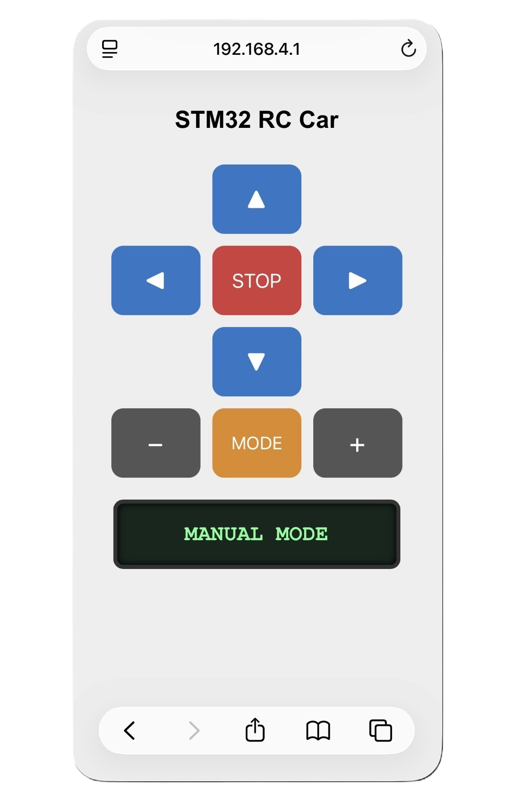
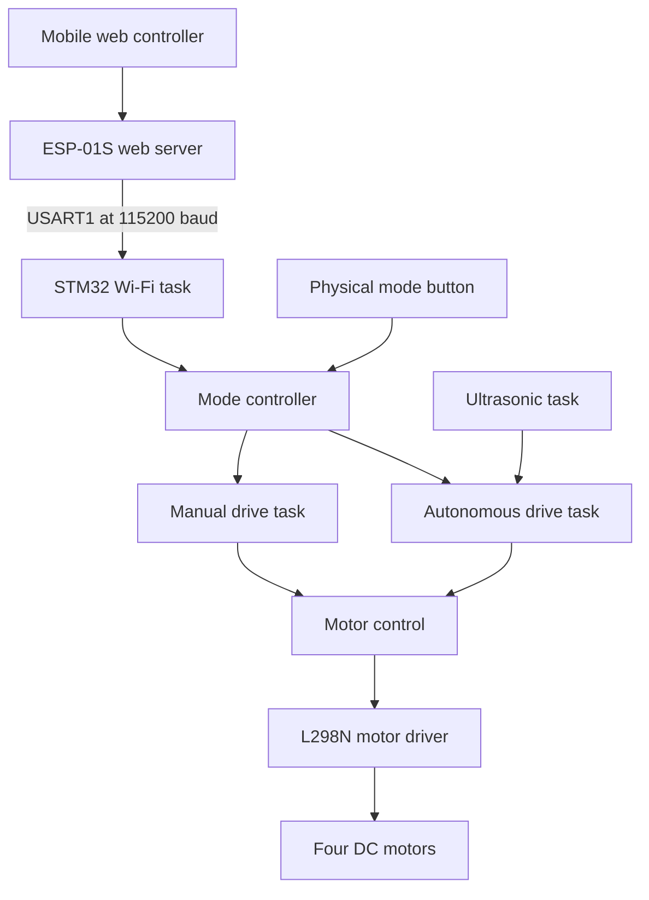

# STM32 FreeRTOS 4WD Autonomous & Wi-Fi RC Car

## Overview

This project is a four-wheel-drive robotic car built around the STM32 NUCLEO-F411RE. It supports two operating modes:

- **Manual mode:** The user controls the car through a mobile-friendly webpage hosted by an ESP-01S.
- **Autonomous mode:** Three ultrasonic sensors measure the front, left, and right distances so the car can detect obstacles and select a safe direction.

FreeRTOS separates Wi-Fi communication, manual driving, autonomous navigation, ultrasonic measurement, and mode switching into independent real-time tasks. The ESP-01S and STM32 communicate through USART1 using short command frames.

## Demonstration

[▶ Watch the Autonomous driving demonstration]
https://youtube.com/shorts/UZM03QLA61s?si=9ukpCIgxdn7mIF0P


### ESP-01S Wi-Fi Control Interface

The ESP-01S hosts the control webpage at `192.168.4.1`. The same interface is used in both operating modes and displays the currently active mode.

<table>
  <tr>
    <th>Manual Mode</th>
    <th>Autonomous Mode</th>
  </tr>
  <tr>
    <td>
      
    </td>
    <td>
      
    </td>
  </tr>
</table>

## Main Features

- Manual and autonomous operating modes
- Mobile-friendly Wi-Fi remote control
- Forward, backward, left, right, and stop controls
- Adjustable manual driving speed
- Webpage and physical-button mode switching
- Front, left, and right ultrasonic distance measurement
- Obstacle detection and avoidance
- Automatic path-centering correction
- Pivot turning for sharp corners
- FreeRTOS-based multitasking
- UART interrupt communication
- PWM motor-speed control
- Safe motor stop during mode changes
- Manual-command timeout for communication safety
- Automatic stop when the front sensor reading is invalid or outdated

## Hardware

| Component | Purpose |
| --- | --- |
| STM32 NUCLEO-F411RE | Main controller and FreeRTOS host |
| ESP-01S (ESP8266) | Wi-Fi access point and web server |
| L298N | Dual DC motor driver |
| Four DC motors | Four-wheel-drive movement |
| Three ultrasonic sensors | Front, left, and right distance measurement |
| 4WD chassis | Mechanical car platform |
| 12 V battery pack | Primary power source |
| Nucleo user button | Physical mode switching |
| Nucleo onboard LED | Current-mode indication |

## Software

- STM32CubeIDE
- STM32CubeMX
- Arduino IDE
- FreeRTOS with CMSIS-RTOS v2
- STM32 HAL
- ESP8266 Wi-Fi library
- ESP8266 WebServer library

## System Architecture



Only the driving task associated with the active mode is allowed to control the motors.

## How the System Works

1. The ESP-01S creates the `STM32_RC_CAR` Wi-Fi network and hosts the control webpage.
2. The user connects a phone or computer to the network and opens `192.168.4.1`.
3. The webpage sends commands to the ESP-01S web server.
4. The ESP-01S converts each request into a three-character UART frame such as `<F>` or `<A>`.
5. The STM32 receives the frame through a USART1 receive interrupt.
6. `WifiTask` validates and processes the received command.
7. The mode controller gives motor control to either `ManualDriveTask` or `AutoDriveTask`.
8. The selected driving task sends movement commands to the PWM and motor-control modules.
9. The L298N controls the four DC motors.

## Operating Modes

### Manual Mode

The car is controlled through the webpage hosted by the ESP-01S.

| Webpage control | Action |
| --- | --- |
| `▲` | Move forward |
| `▼` | Move backward |
| `◀` | Pivot left |
| `▶` | Pivot right |
| `STOP` | Stop the car |
| `+` | Increase driving speed |
| `−` | Decrease driving speed |
| `MODE` | Switch to autonomous mode |

The car always starts in manual mode with the motors stopped. Direction commands are repeatedly transmitted while a direction button is held. Releasing the button sends a stop command.

If the STM32 does not receive an updated manual command within the configured timeout, it stops the motors automatically.

### Autonomous Mode

The autonomous controller uses the front, left, and right ultrasonic sensors to examine the surrounding space.

It can:

- Drive forward when the path is clear
- Compare the left and right distances
- Adjust the left and right motor speeds to remain near the center of the track
- Stop when a front obstacle is detected
- Select the side with more available space
- Reverse briefly when both sides are blocked
- Perform pivot turns at sharp corners
- Stop when the front measurement is invalid or outdated

The driving speeds, obstacle thresholds, centering correction, and turning times are defined in `Core/Inc/car_config.h` and were tuned for the test track.

Manual direction and speed controls are ignored while autonomous mode is active. The STOP and MODE controls remain available.

## Wi-Fi Control

The ESP-01S operates as a standalone Wi-Fi access point.

```text
Network name: STM32_RC_CAR
Password:     12345678
IP address:   192.168.4.1
```

After connecting to the network, open `192.168.4.1` in a web browser. The webpage provides direction, speed, stop, and mode controls.

The ESP-01S communicates with the STM32 through USART1 at `115200` baud.

## UART Command Protocol

Each command is sent as one character enclosed by angle brackets:

```text
<command>
```

Examples:

```text
<F>
<S>
<A>
<M>
```

| Command | UART frame | Action |
| --- | --- | --- |
| `F` | `<F>` | Move forward |
| `B` | `<B>` | Move backward |
| `L` | `<L>` | Pivot left |
| `R` | `<R>` | Pivot right |
| `S` | `<S>` | Stop |
| `+` | `<+>` | Increase manual speed |
| `-` | `<->` | Decrease manual speed |
| `A` | `<A>` | Switch to autonomous mode |
| `M` | `<M>` | Switch to manual mode |

The webpage presents one MODE button. The ESP-01S generates the internal `A` or `M` command according to the next operating mode.

## FreeRTOS Tasks

| Task | Responsibility |
| --- | --- |
| `WifiTask` | Processes commands received from the ESP-01S |
| `ManualDriveTask` | Controls the motors in manual mode |
| `AutoDriveTask` | Executes autonomous navigation |
| `UltrasonicTask` | Measures front, left, and right distances |
| `ButtonTask` | Handles the physical mode button and mode LED |
| `defaultTask` | Reserved background task |

The tasks run independently, but the mode controller ensures that only one driving task has control of the motors.

## Mode Switching

The operating mode can be changed using:

- The MODE button on the control webpage
- The physical user button on the Nucleo board

Every mode change stops the motors before motor control is transferred to the other driving task.

The Nucleo onboard LED indicates the current STM32 mode:

| LED state | Mode |
| --- | --- |
| Off | Manual |
| On | Autonomous |

## Safety Behavior

- The system starts in manual mode with the motors stopped.
- The motors stop before every operating-mode change.
- A manual-command timeout stops the car if communication is interrupted.
- The STOP command is accepted in both modes.
- Manual movement commands are blocked during autonomous operation.
- Autonomous driving stops if the front ultrasonic data is invalid or outdated.

## Project Structure

```text
.
├── Core/
│   ├── Inc/
│   │   ├── auto_drive.h
│   │   ├── button.h
│   │   ├── car_config.h
│   │   ├── manual_drive.h
│   │   ├── mode.h
│   │   ├── motor.h
│   │   ├── pwm.h
│   │   ├── ultrasonic.h
│   │   └── wifi.h
│   └── Src/
│       ├── auto_drive.c
│       ├── button.c
│       ├── freertos.c
│       ├── main.c
│       ├── manual_drive.c
│       ├── mode.c
│       ├── motor.c
│       ├── pwm.c
│       ├── ultrasonic.c
│       └── wifi.c
└── ESP8266/
    └── esp_01s_control/
        └── esp_01s_control.ino


```

## Building and Running the Project

### STM32 Firmware

1. Clone or download this repository.
2. Open STM32CubeIDE.
3. Select **File → Import → Existing Projects into Workspace**.
4. Select the repository directory as the project location.
5. Build the STM32 project.
6. Connect the NUCLEO-F411RE through ST-LINK.
7. Run or debug the firmware on the board.

### ESP-01S Firmware

1. Open `ESP8266/esp_01s_control/esp_01s_control.ino` in Arduino IDE.
2. Select the ESP8266 board configuration used for the ESP-01S.
3. Select the correct upload port.
4. Upload the sketch to the ESP-01S.
5. Connect the ESP-01S serial interface to STM32 USART1 and connect both devices to a common ground.

### Operating the Car

1. Power on the car.
2. Connect a phone or computer to the `STM32_RC_CAR` Wi-Fi network.
3. Enter `12345678` when the Wi-Fi password is requested.
4. Open `192.168.4.1` in a browser.
5. Use the direction, speed, STOP, and MODE buttons to operate the car.

## Skills Demonstrated

- STM32 peripheral configuration
- STM32CubeMX code generation
- FreeRTOS task design
- UART interrupt communication
- Framed serial-command parsing
- PWM motor-speed control
- Web-based embedded control
- ESP8266 access-point and web-server programming
- Ultrasonic sensor interfacing
- State-machine design
- Autonomous obstacle avoidance
- Proportional path-centering correction
- Real-time debugging and track tuning
- Embedded hardware and software integration

## Author

GitHub: `@anonyminus`

Embedded systems project developed using the STM32 NUCLEO-F411RE, FreeRTOS, and ESP8266.
